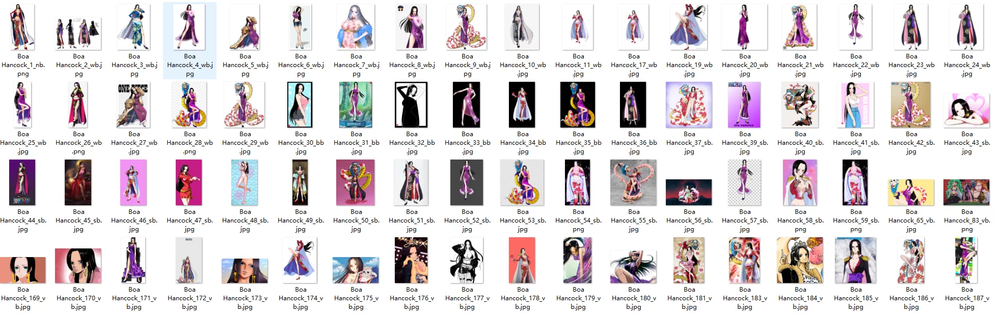
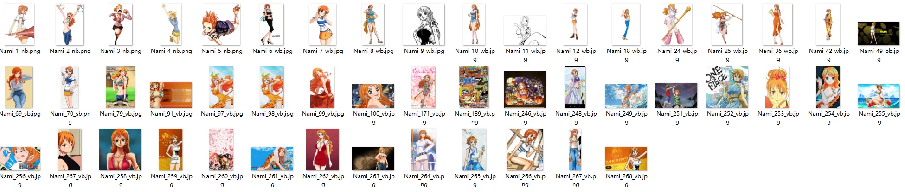
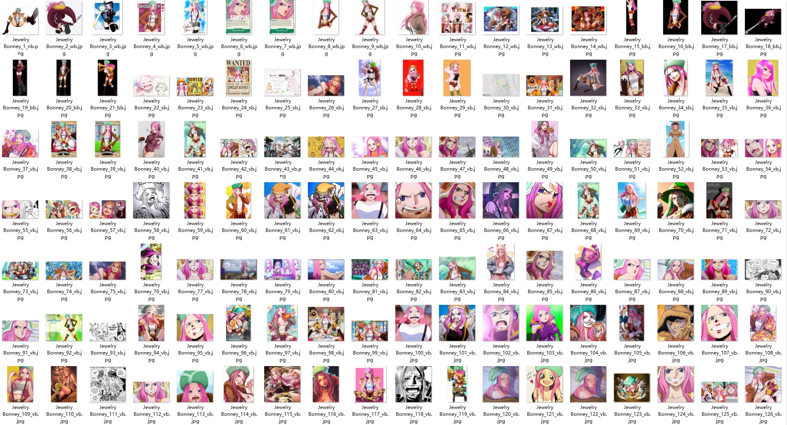
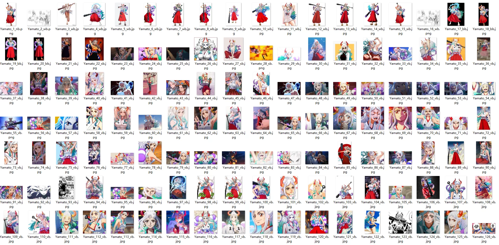
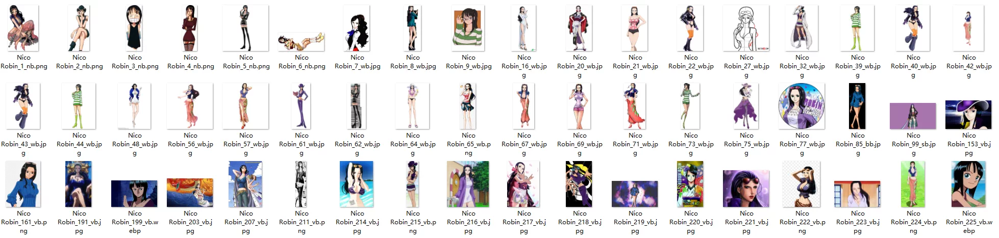
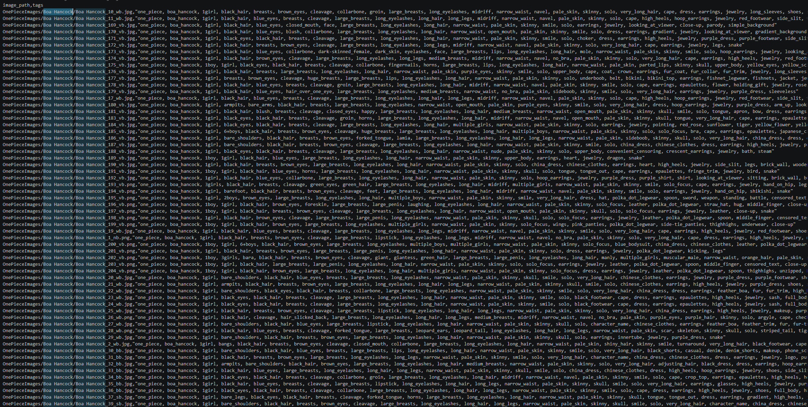

## Body

The "One Piece" character multimodal dataset includes large-scale, categorized image collections from the "One Piece" universe, specifically designed for computer vision tasks such as image classification, generative modeling (stable diffusion/LoRA training), and retrieval-based AI systems.

It consists of 32,634 images, divided into 1,502 folders, each representing a character, with only images belonging to that character in each folder. The total dataset size is approximately 5 GB. The data structure is strict, including descriptive metadata tags for each image, facilitating high-quality image generation and subtitle work.

The dataset's structure is designed to maintain a clear association between character folders and their corresponding metadata, has been meticulously structured and actively cleaned, catering to researchers and creators who require high-quality, labeled data without manual preprocessing.

Folder hierarchy:
ImageTags.csv: Containing relative image paths along with related descriptional tags (such as character features, attire, and artistic style).
OnePieceImages/: The root directory for all character subfolders.
-----[Character Name]/: Independent folders for each of the 1,502 characters, containing their respective images.

Expected use cases:
-----Character classification and recognition: The dataset's structure is ready for use in PyTorch or Keras datasets. ImageFolder
-----Image generation and fine-tuning: Use this feature to train LoRA or fine-tune diffusion models. ImageTags.csv
-----Anime face recognition: Preprocess images for facial marking and recognition.
-----Low-shot/zero-shot learning: Benchmark on a massive 1,502 unique character professions.
-----RAG or embedding-based retrieval: Perfect for building image search systems or vector databases for styled media.
-----Visual model benchmark tests: Test model performance on a large-scale, fine-grained anime character dataset.

⚠️

## Images

item_1047642544596

Here is a pay link on Stripe ( https://buy.stripe.com/3cs8yP7sY87d0vu9AB ). Please contact me lonlonago@foxmail.com after funding $89, and I will send you a complete data files , thank you!

